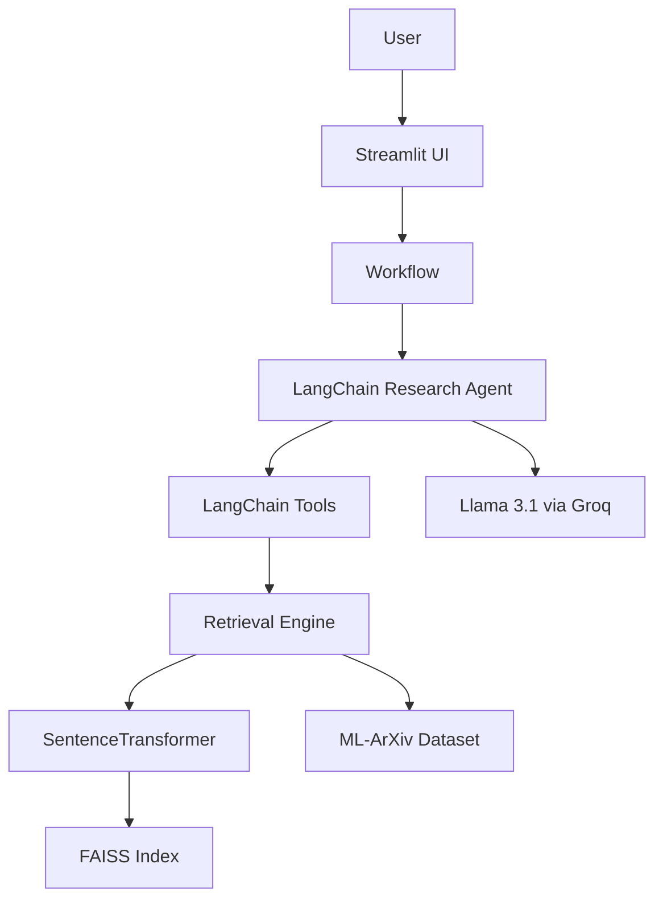

# 🤖 Ag 


An **Agentic AI-powered Research Assistant** that enables semantic search and intelligent question answering over **15,000+ Machine Learning research papers** from the **ML-ArXiv** dataset.

Instead of relying on keyword search, the system combines **SentenceTransformers**, **FAISS**, **LangChain**, and **Groq-powered Llama 3.1** to retrieve the most relevant research papers and generate grounded, context-aware responses.

The project follows a modular architecture where retrieval, tools, agent initialization, workflow orchestration, and the Streamlit frontend are cleanly separated.

---

# ✨ Features

- 🤖 Agentic AI workflow using LangChain
- 🔍 Semantic search over 15,000+ ML research papers
- 📚 FAISS vector similarity search
- 🧠 SentenceTransformer embeddings
- ⚡ Groq-powered Llama 3.1 reasoning
- 🛠 Modular retrieval-engine architecture
- 💬 Interactive Streamlit chat interface
- 💡 Suggested research prompts
- 📤 Export chat functionality
- 🎨 Modern responsive UI

---

# 📊 Project Highlights

- **Dataset:** ML-ArXiv Papers (15,000+ papers)
- **Embedding Model:** all-MiniLM-L6-v2
- **Vector Database:** FAISS
- **LLM:** Llama 3.1 (via Groq)
- **Framework:** LangChain
- **Frontend:** Streamlit
- **Architecture:** Modular Agentic AI Pipeline

---

# 📸 Screenshots

> Add screenshots before publishing the final portfolio.

```text
docs/screenshots/home.png
docs/screenshots/chat.png
docs/screenshots/sidebar.png
```

or

```markdown


```

---

# 🎥 Demo

Add a short GIF or screen recording.

```text
docs/demo/research-assistant-demo.gif
```

---

# 🏗 Architecture



---

# 📁 Project Structure

```text
.
├── data/
│   ├── index/
│   │   └── faiss.index
│   └── raw/
│       └── paper_embeddings.npy
│
├── src/
│   ├── base/
│   │   ├── engine.py
│   │   ├── MB_CB_SRC_Research_Paper_Intelligence_System.ipynb
│   │   └── mb_cb_src_research_paper_intelligence_system.py
│   │
│   └── agentic/
│       ├── __init__.py
│       ├── config.py
│       ├── prompts.py
│       ├── tools.py
│       ├── agent.py
│       ├── workflow.py
│       └── main.py
│
├── requirements.txt
├── README.md
├── .env.example
└── .gitignore
```

The original CBSOT notebook and exported Python implementation are preserved for reference.

Production execution path:

```text
main.py
    ↓
workflow.py
    ↓
agent.py
    ↓
tools.py
    ↓
engine.py
```

---

# 🛠 Technology Stack

| Layer | Technology |
|--------|------------|
| Frontend | Streamlit |
| Agent Framework | LangChain |
| LLM | Llama 3.1 (Groq) |
| Retrieval | FAISS |
| Embeddings | SentenceTransformers |
| Dataset | Hugging Face Datasets |
| Environment | python-dotenv |

---

# 🚀 Installation

## Clone Repository

```bash
git clone <repository-url>
cd Agentic-AI-Research-Paper-Intelligence-System
```

---

## Create Virtual Environment

### Windows

```powershell
python -m venv .venv
.\.venv\Scripts\Activate.ps1
```

### macOS/Linux

```bash
python -m venv .venv
source .venv/bin/activate
```

---

## Install Dependencies

```bash
pip install --upgrade pip
pip install -r requirements.txt
```

---

## Configure Environment

Create a `.env` file.

```text
GROQ_API_KEY=your_groq_api_key_here
```

---

# 📚 Build / Rebuild FAISS Index

The repository already includes:

```
data/index/faiss.index
data/raw/paper_embeddings.npy
```

If the index is missing:

```bash
python -c "from src.base.engine import initialize_engine; initialize_engine()"
```

This will

- download the dataset
- generate embeddings
- create the FAISS index
- cache everything locally

---

# ▶️ Run the Application

```bash
streamlit run src/agentic/main.py
```

Open

```
http://localhost:8501
```

---

# 💬 Example Queries

- Explain Vision Transformers
- Explain LoRA
- Recent Diffusion Model Papers
- Papers about RLHF
- Graph Neural Networks
- Compare Vision Transformers with CNNs
- Reinforcement Learning from Human Feedback

---

# 🔄 Project Workflow

1. User submits a research query.
2. Workflow validates the request.
3. LangChain Agent receives the query.
4. Agent invokes retrieval tools.
5. Retrieval Engine performs semantic search using SentenceTransformers + FAISS.
6. Top-k research papers are returned.
7. Llama 3.1 reasons over retrieved papers.
8. Streamlit displays the grounded response.

---

# ✅ Verification

### Verify Semantic Search

```bash
python -c "from src.base.engine import search_papers; r = search_papers('graph neural networks',3); print(r['results'][0]['title'])"
```

---

### Verify Groq Integration

```bash
python -c "from src.agentic.workflow import process_user_query; print(process_user_query('Explain Vision Transformers'))"
```

A valid `GROQ_API_KEY` is required.

---

# 📌 Future Improvements

- Research paper cards with citations
- Paper comparison mode
- Conversation memory
- Multi-agent workflows
- Better metadata visualization
- Automated testing
- Cloud deployment
- Docker support

---

# 🙏 Acknowledgements

- Hugging Face Datasets
- ML-ArXiv Dataset
- SentenceTransformers
- FAISS
- LangChain
- Groq
- Streamlit

---

# 📄 License

This project is licensed under the **MIT License**.

See the `LICENSE` file for details.